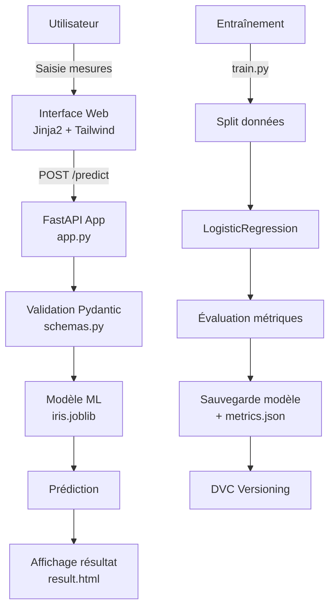
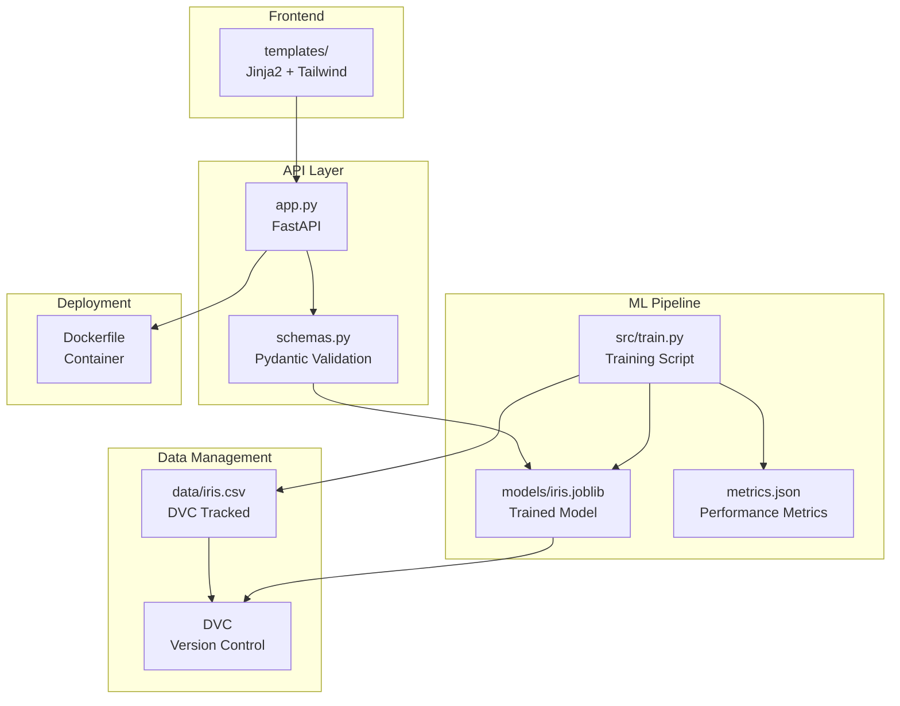

<div align="center">

  <h1>🌸 Iris Flower Classification - MLOps Pipeline</h1>

  <p>
    Une application MLOps complète pour la classification d'iris avec interface web moderne, API REST, et pipeline d'entraînement automatisé.
  </p>

  <p>
    
    
    
    
    
    
  </p>

  <sub>Production-Ready. Scalable. Beautiful. ✨</sub>

</div>

---

## 🚀 Aperçu

Cette application MLOps propose une solution complète pour la classification des fleurs d'iris, combinant :

- **Interface Web Moderne** : Interface utilisateur élégante avec Tailwind CSS et Jinja2
- **API REST** : Endpoints FastAPI pour intégration programmatique
- **Pipeline MLOps** : Gestion de version des données et modèles avec DVC
- **Dockerisation** : Déploiement containerisé facile
- **Validation** : Validation des données avec Pydantic
- **Métriques** : Suivi des performances du modèle

---

## 🧭 Fonctionnalités clés

- **Classification en temps réel** : Prédiction instantanée de l'espèce d'iris (Setosa, Versicolor, Virginica)
- **Interface web responsive** : Design moderne et adaptatif avec Tailwind CSS
- **API REST complète** : Endpoints pour prédiction, santé de l'application et métriques
- **Versioning des données** : Gestion de version des données et modèles avec DVC
- **Pipeline d'entraînement** : Script d'entraînement automatisé avec évaluation
- **Containerisation** : Dockerfile optimisé pour production
- **Validation robuste** : Validation des entrées avec Pydantic et gestion d'erreurs

---

## 🗺️ Flow de bout en bout (Mermaid)



---

## 🏗️ Architecture (Mermaid)



---

## 📦 Structure du projet

```
mlops-anicet/
  ├── app.py                 # Application FastAPI principale
  ├── schemas.py             # Modèles Pydantic pour validation
  ├── src/
  │   └── train.py          # Script d'entraînement du modèle
  ├── templates/
  │   ├── base.html         # Template de base avec Tailwind CSS
  │   ├── index.html        # Page d'accueil avec formulaire
  │   ├── result.html       # Page de résultats
  │   └── error.html        # Page d'erreur
  ├── tests/
  │   ├── __init__.py       # Package tests
  │   ├── test_api.py       # Tests pour l'API
  │   └── test_model.py     # Tests pour le modèle
  ├── data/
  │   ├── iris.csv          # Dataset (tracké par DVC)
  │   └── iris.csv.dvc      # Fichier DVC pour versioning
  ├── models/
  │   ├── iris.joblib       # Modèle entraîné (tracké par DVC)
  │   └── iris.pkl.dvc      # Fichier DVC pour versioning
  ├── metrics.json          # Métriques du modèle (accuracy)
  ├── requirements.txt      # Dépendances Python
  ├── Dockerfile            # Configuration Docker
  ├── docker-compose.yml    # Orchestration Docker
  ├── .dockerignore         # Fichiers ignorés par Docker
  ├── .gitignore            # Fichiers ignorés par Git
  ├── Makefile              # Commandes utiles
  ├── pytest.ini            # Configuration pytest
  ├── setup.py              # Configuration package
  ├── LICENSE               # Licence MIT
  ├── CHANGELOG.md          # Historique des versions
  ├── CONTRIBUTING.md       # Guide de contribution
  ├── USAGE_MAKEFILE.md     # Guide d'utilisation du Makefile
  └── README.md             # Ce document ✨
```

---

## 🛠️ Installation

### 1) Pré-requis

- Python 3.9+
- Docker (optionnel, pour containerisation)
- DVC (pour la gestion de version des données)

### 2) Cloner le repository

```bash
git clone <your-repo-url>
cd mlops-anicet
```

### 3) Installation des dépendances

```bash
# Créer un environnement virtuel
python -m venv .venv

# Activer l'environnement virtuel
# Windows
.venv\Scripts\activate
# macOS/Linux
source .venv/bin/activate

# Installer les dépendances
pip install -r requirements.txt
```

### 4) Télécharger les données et modèles avec DVC

```bash
# Installer DVC si ce n'est pas déjà fait
pip install dvc

# Télécharger les données et modèles versionnés
dvc pull
```

### 5) Entraîner le modèle (optionnel)

#### Option 1: Avec python directement

```bash
# Si vous voulez réentraîner le modèle
python src/train.py
```

#### Option 2: Avec Make (Linux/macOS)

```bash
make train
```

#### Option 3: Avec PowerShell (Windows)

```powershell
.\run.ps1 train
```

---

## ▶️ Utilisation

### Lancer l'application localement

#### Option 1: Avec uvicorn directement

```bash
uvicorn app:app --reload --host 0.0.0.0 --port 8000
```

#### Option 2: Avec Make (Linux/macOS)

```bash
make run
```

#### Option 3: Avec PowerShell (Windows - recommandé)

```powershell
.\run.ps1 run
```

**Note :** Sur Windows, `make` n'est pas installé par défaut. Utilisez le script PowerShell `run.ps1` à la place. Voir la section [Utilisation sur Windows](#-utilisation-sur-windows) ci-dessous.

L'application sera accessible à l'adresse : `http://localhost:8000`

### Utiliser l'interface web

1. Ouvrez votre navigateur à `http://localhost:8000`
2. Saisissez les mesures de l'iris (sepal length, sepal width, petal length, petal width)
3. Cliquez sur "Predict Species" pour obtenir la prédiction

### Utiliser l'API REST

#### Prédiction via API

```bash
curl -X POST "http://localhost:8000/api/predict" \
  -H "Content-Type: application/json" \
  -d '{
    "sepal_length": 5.1,
    "sepal_width": 3.5,
    "petal_length": 1.4,
    "petal_width": 0.2
  }'
```

#### Vérifier la santé de l'application

```bash
curl http://localhost:8000/health
```

#### Obtenir les métriques du modèle

```bash
curl http://localhost:8000/metrics
```

---

## 🐳 Déploiement avec Docker

### Construction de l'image

#### Option 1: Avec docker directement

```bash
docker build -t iris-classifier .
```

#### Option 2: Avec Make (Linux/macOS)

```bash
make docker-build
```

#### Option 3: Avec PowerShell (Windows)

```powershell
.\run.ps1 docker-build
```

### Exécution du container

#### Option 1: Avec docker directement

```bash
docker run -p 8000:8080 iris-classifier
```

#### Option 2: Avec Make (Linux/macOS)

```bash
make docker-run
```

#### Option 3: Avec PowerShell (Windows)

```powershell
.\run.ps1 docker-run
```

### Utilisation avec Docker Compose

#### Option 1: Avec docker-compose directement

```bash
docker-compose up -d
```

#### Option 2: Avec Make (Linux/macOS)

```bash
make docker-compose-up
```

#### Option 3: Avec PowerShell (Windows)

```powershell
.\run.ps1 docker-up
```

Pour arrêter les services :

#### Option 1: Avec docker-compose directement

```bash
docker-compose down
```

#### Option 2: Avec Make (Linux/macOS)

```bash
make docker-compose-down
```

#### Option 3: Avec PowerShell (Windows)

```powershell
.\run.ps1 docker-down
```

L'application sera accessible à `http://localhost:8000`

---

## 🧪 Tests

### Exécuter les tests

#### Option 1: Avec pytest directement

```bash
# Tous les tests
pytest

# Tests avec couverture
pytest --cov=app --cov=src tests/

# Tests spécifiques
pytest tests/test_api.py
pytest tests/test_model.py
```

#### Option 2: Avec Make

```bash
# Tous les tests
make test

# Tests avec couverture
make test-cov
```

---

## ⚙️ Détails techniques

### Stack technologique

- **FastAPI** : Framework web moderne et rapide pour l'API
- **Scikit-learn** : Machine Learning avec LogisticRegression
- **Pydantic** : Validation des données et schémas
- **Jinja2** : Moteur de templates pour l'interface web
- **Tailwind CSS** : Framework CSS utilitaire pour le design
- **DVC** : Gestion de version des données et modèles
- **Docker** : Containerisation pour le déploiement
- **Pytest** : Framework de tests

### Endpoints API

| Endpoint | Méthode | Description |
|----------|---------|-------------|
| `/` | GET | Interface web principale |
| `/predict` | POST | Prédiction via formulaire HTML |
| `/api/predict` | POST | Prédiction via API REST (JSON) |
| `/health` | GET | Vérification de la santé de l'application |
| `/metrics` | GET | Métriques du modèle (accuracy) |
| `/docs` | GET | Documentation interactive Swagger UI |

### Modèle ML

- **Algorithme** : Logistic Regression
- **Features** : sepal_length, sepal_width, petal_length, petal_width
- **Target** : species (Setosa, Versicolor, Virginica)
- **Accuracy** : 100% (sur le dataset de test)

---

## 📊 Métriques et performances

Les métriques du modèle sont stockées dans `metrics.json` :

```json
{
  "accuracy": 1.0
}
```

---

## 🔐 Gestion des erreurs

L'application inclut une gestion robuste des erreurs :

- Validation des entrées avec Pydantic
- Gestion des erreurs de modèle
- Messages d'erreur clairs pour l'utilisateur
- Logging des erreurs pour le débogage

---

## 🪟 Utilisation sur Windows

### Pourquoi `make` ne fonctionne pas ?

`make` est un outil Unix/Linux qui n'est **pas installé par défaut sur Windows**. Vous avez plusieurs options :

### ✅ Solution recommandée : Utiliser le script PowerShell

Un script PowerShell `run.ps1` a été créé pour remplacer `make` sur Windows :

```powershell
# Voir toutes les commandes disponibles
.\run.ps1 help

# Installer les dépendances
.\run.ps1 install

# Lancer l'application
.\run.ps1 run

# Entraîner le modèle
.\run.ps1 train

# Lancer les tests
.\run.ps1 test
```

### Autres options pour utiliser `make` sur Windows

#### Option 1 : Installer Make via Chocolatey

```powershell
# Installer Chocolatey (si pas déjà installé)
# Puis installer Make
choco install make
```

#### Option 2 : Utiliser WSL (Windows Subsystem for Linux)

```bash
# Dans WSL
sudo apt-get update
sudo apt-get install make
```

#### Option 3 : Utiliser les commandes directement

Au lieu de `make run`, utilisez directement :

```powershell
uvicorn app:app --reload --host 0.0.0.0 --port 8000
```

**Voir [USAGE_MAKEFILE.md](USAGE_MAKEFILE.md) pour la liste complète des équivalents.**

### Tableau de correspondance des commandes

| Commande Make | Commande PowerShell | Commande directe |
|---------------|---------------------|------------------|
| `make install` | `.\run.ps1 install` | `pip install -r requirements.txt` |
| `make run` | `.\run.ps1 run` | `uvicorn app:app --reload --host 0.0.0.0 --port 8000` |
| `make train` | `.\run.ps1 train` | `python src/train.py` |
| `make test` | `.\run.ps1 test` | `pytest` |
| `make docker-build` | `.\run.ps1 docker-build` | `docker build -t iris-classifier .` |

---

## 🚀 Améliorations futures

- [ ] Ajout de tests d'intégration
- [ ] Intégration CI/CD avec GitHub Actions
- [ ] Monitoring avec Prometheus/Grafana
- [ ] Support de plusieurs modèles
- [ ] Interface d'administration
- [ ] Export des prédictions en CSV
- [ ] Authentification et autorisation
- [ ] Cache des prédictions
- [ ] Support de batch predictions

---

## 🤝 Contribution

Les contributions sont les bienvenues ! N'hésitez pas à :

1. Fork le projet
2. Créer une branche pour votre fonctionnalité (`git checkout -b feature/AmazingFeature`)
3. Commit vos changements (`git commit -m 'Add some AmazingFeature'`)
4. Push vers la branche (`git push origin feature/AmazingFeature`)
5. Ouvrir une Pull Request

---

## 📜 Licence

Ce projet est sous licence MIT. Voir le fichier `LICENSE` pour plus de détails.

---

## 👤 Auteur

**Anicet**

- Projet : [MLOps Iris Classifier](https://github.com/AZEGHAANICET/mlops-project)

---

## 🙏 Remerciements

- Dataset Iris de scikit-learn
- Communauté FastAPI
- Communauté MLOps

---

<div align="center">
  <sub>Construit avec ❤️ pour démontrer les meilleures pratiques MLOps</sub>
</div>

